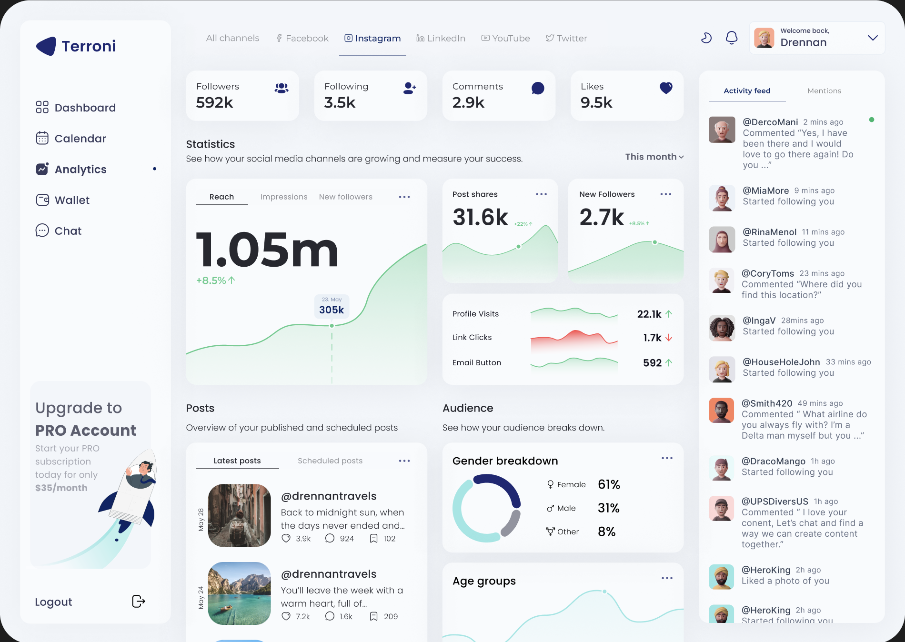

# Example Dashboard Project

## Currently Completed:

  * Dashboard Nav Bar
  * Basic imports
  * flex layout
  * light mode

## TODOs
  * Components for nav (better structure)
  * Fake data
  * central nav
  * charts (use recharts)
  * routing

Design:

https://www.figma.com/design/BtOSWqzuQPApxy6PdFjmaf/example-dash?node-id=0%3A1&t=ZZDMQmjpq5Jsiuk5-1

